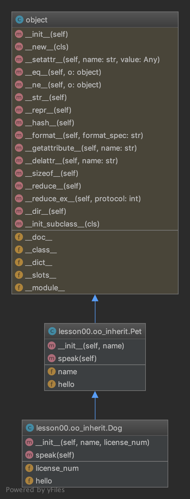

########################
Object Oriented Concepts
########################

Object orientation is a popular programming model that focuses on
development of classes. Classes contain the logic and data of the
application, which are then used in development by creating, or
instantiating, objects from those classes.

Object orientation allows developers to design applications in such a way
that technical concepts and problem domain concepts are kept separate.

Why would I want to do that?
----------------------------
Let's be sure we understand the term 'problem domain' first. The problem
domain is the functionality and data that is needed to meet the application's
requirements. It excludes the technical and framework concepts that are
used to help deliver the requirements.

This approach brings several major benefits:

- The problem domain changes at a different rate to the technology it
  uses. As developers, when a new version of the technology we use
  becomes available we want to make the transition as simple as possible. Well,
  designed systems allow this to happen, and good understanding of
  object orientation makes this even more simple.
- Often the teams or levels of expertise required to maintain
  problem domain functionality are different to those for the frameworks
  that run this technology. Keeping the problem domain separate helps
  to enable this.
- Problem domain logic is where application developers can add the most
  value to their clients, and keeping it separate from the technology 
  helps to increase the lifetime of the problem domain logic.

Now all of this is fine, but it requires skill, experience and even good
taste to achieve this! It is also true that this sort of approach with
object orientation in not a universal one. It takes longer to build
applications this way, so this approach is only applicable where you are
building software that needs to last for years.

Also, other approaches such as functional programming can be better suited;
it just depends on what you are building, its lifetime and your knowledge
and experience.

To learn more from the definitive source consider reading Domain Driven Design,
by Eric Evans. While it's a great book, it takes some time to really
understand how to apply what it teaches.

Here is an example of a simple object oriented Python module:

.. code:: Python

    """
    simple oo example
    """
    class Pet:
       """ This class defines Pet, which is an animal kept by a human for domestic purposes" """
       def __init__(self, name):
           self.name = name
           self.hello = "None"

       def speak(self):
           """ sample - maybe lots of code in this """
           return self.hello

       def swim(self):
           return "splash"

    mypet = Pet("Goldie") # i am an object: an instance of the class Pet

    print(mypet.name)
    print(mypet.speak())
    print(mypet.swim())

Here we have a Pet class. The Pet can speak and swim. Notice how we use
real world terminology, rather than technical words, as far as someone
who uses Pet is concerned. Inside Pet, it does get a bit technical
but that is hidden from the developer who uses Pet. This sort of hiding
is called encapsulation.

Inheritance
-----------
What if we have different types of Pet? Goldfish? Dogs? Cats? Even a python?

If we start to observe concepts that are similar, but have different behaviors
and / or data, it might be an indicator that we need to use inheritance.

You can easily identify if inheritance is needed when you see concepts that relate
to other concepts with the phrase 'is a'. A dog is a pet. So is a cat. A
python
might be too, but it is also a programming language! In this case lets assume
it is a pet.

We can draw this on a diagram:

Dog, Cat, and Python inherit from Pet. We can also say that Pet is the superclass,
and the others are subclasses.

Here it is in code:

.. code:: Python

    """
    simple oo example
    """

    class Pet:
       def __init__(self, name):
           self.name = name
           self.hello = None

       def speak(self):
           """ sample - maybe lots of code in this """
           return self.hello

    class Dog(Pet):
       def __init__(self, name, license_num):
           Pet.__init__(self, name)
           self.hello = "woof"

           # i can specialize and add to subclass
           self.license_num = license_num

       def speak(self):
           """ reuse or embelish code from superclass """
           return Pet.speak(self)

    mypet = Pet("Goldie")
    print(mypet.name)
    print(mypet.speak())

    mypet = Dog("Bogart", "AB56674")
    print(mypet.name)

    # i just tell it to speak
    print(mypet.speak())

    print(mypet.license_num)

Notice how the subclass can use the superclasses data and functions?

Here's a quick guide to Python OO: https://python.swaroopch.com/oop.html

But how do I know which classes I need?
---------------------------------------
- Think about your problem domain. Find some related documentation (ideally
  from the person who is requesting the development). Failing that, talk to
  the person who made the request. Note down what they are asking you to do.

- When you have the notes and/or documentation, use a highlighter to mark
  all of the nouns. So, in a human resources example, you might highlight
  employee, job, department and company. Think of some others...

- Get a large piece of paper and small yellow stickies. Alternatively,
  use a modeling tool. For example: https://www.genmymodel.com/

- Now, either write each noun on a separate sticky, or start to build a
  model. We'll show the modeling tool. It will quickly become obvious
  how to do this with stickies.

#. Some comments:
   
   1. Keep problem domain code separate from technical code. Why?
   
   2. Don't spend too long modeling. Start coding and demoing as soon as you can. Why?
   
   3. Focus on what your classes do, not what they need to know. Why?
   
   4. Define all classes in docstrings. Why?
   
   5. Decomposition and business boundaries. Why?
   
   6. State transitions.
   
   7. GenMyModel is not free; use draw.io (but you lose code generation).

#. There's loads more to learn! Here are some resources:

   1. GenMyModel: https://www.genmymodel.com
   
   2. DDD book: https://www.infoq.com/minibooks/domain-driven-design-quickly
   
   3. OO in Python: https://realpython.com/python3-object-oriented-programming/
   
   4. More Python OO: https://jeffknupp.com/blog/2014/06/18/improve-your-python-python-classes-and-object-oriented-programming/
   5. OO thought process: https://www.amazon.com/Object-Oriented-Thought-Process-Developers-Library/dp/0321861272
   
   6. Conway's law: https://en.wikipedia.org/wiki/Conway%27s_law
   
   7. Class models: http://www.agilemodeling.com/artifacts/classDiagram.htm